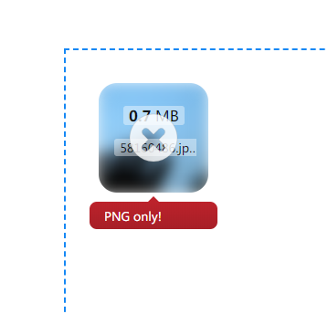

Advanced Usage
===============

Parallel Uploads
----------------

If you set ``DROPZONE_UPLOAD_MULTIPLE`` as True, then you need to save
multiple uploads in single request.

However, you can't get a list of file with
``request.files.getlist('file')``. When you enable parallel upload,
Dropzone.js will append a index number after each files, for example:
``file[2]``, ``file[1]``, ``file[0]``. So, you have to save files like
this:

.. code-block:: python

    for key, f in request.files.items():
        if key.startswith('file'):
            f.save(os.path.join('the/path/to/save', f.filename))

Here is the full example:

.. code-block:: python

    ...
    app.config['DROPZONE_UPLOAD_MULTIPLE'] = True  # enable parallel upload
    app.config['DROPZONE_PARALLEL_UPLOADS'] = 3  # handle 3 file per request

    @app.route('/upload', methods=['GET', 'POST'])
    def upload():
        if request.method == 'POST':
            for key, f in request.files.items():
                if key.startswith('file'):
                    f.save(os.path.join('the/path/to/save', f.filename))

       return 'upload template'

.. tip:: See ``examples/parallel-upload`` for more detail.

CSRF Protect
------------

The CSRF Protect feature was provided by Flask-WTF's ``CSRFProtect``
extension, so you have to install Flask-WTF first:

.. code-block:: bash

    $ pip install flask-wtf

Then initialize the CSRFProtect:

.. code-block:: python

    from flask_wtf.csrf import CSRFProtect

    app = Flask(__name__)

    # the secret key used to generate CSRF token
    app.config['SECRET_KEY'] = 'dev key'
    ...
    # enable CSRF protection
    app.config['DROPZONE_ENABLE_CSRF'] = True

    csrf = CSRFProtect(app)

Make sure to set the secret key and set ``DROPZONE_ENABLE_CSRF`` to
True. Now all the upload request will be protected!

We prefer to handle the CSRF error manually, because the error
response's body will be displayed as tooltip below the file thumbnail.

.. code-block:: python

    from flask_wtf.csrf import CSRFProtect, CSRFError
    ...

    # handle CSRF error
    @app.errorhandler(CSRFError)
    def csrf_error(e):
        return e.description, 400

Here I use the ``e.description`` as error message, it's provided by
CSRFProtect, one of ``The CSRF token is missing`` and
``The CSRF token is invaild``.

Try the demo application in ``examples/csrf`` and see `CSRFProtect's
documentation <http://flask-wtf.readthedocs.io/en/latest/csrf.html>`__
for more details.

Server Side Validation
----------------------

Although Dropzone.js can handle client side validation for uploads, but
you still need to setup server side validation for security conern. Just
do what you normally do (extension check, size check etc.), the only
thing you should remember is to return plain text error message as
response body when something was wrong. Fox example, if we only want
user to upload file with ``.png`` extension, we can do the validation
like this:

.. code-block:: python

    @app.route('/', methods=['POST', 'GET'])
    def upload():
        if request.method == 'POST':
            f = request.files.get('file')
            if f.filename.split('.')[1] != 'png':
                return 'PNG only!', 400  # return the error message, with a proper 4XX code
            f.save(os.path.join('the/path/to/save', f.filename))
        return render_template('index.html')

The error message will be displayed when you hover the thumbnail for
upload file:

   error message

